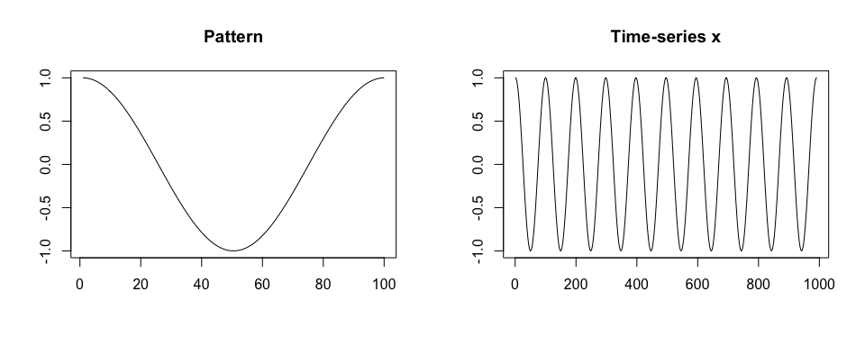
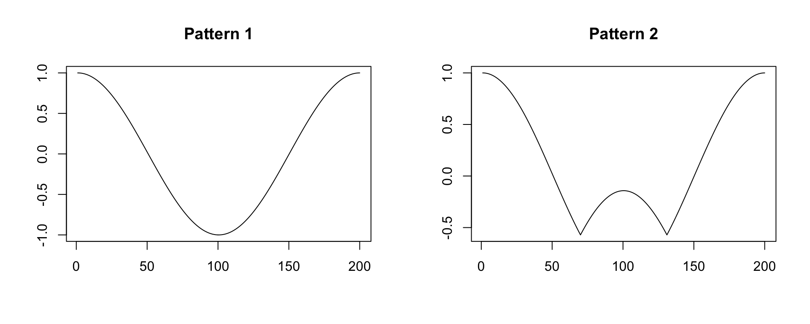
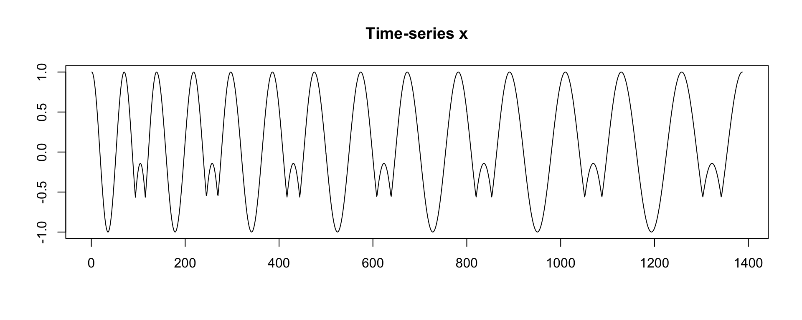
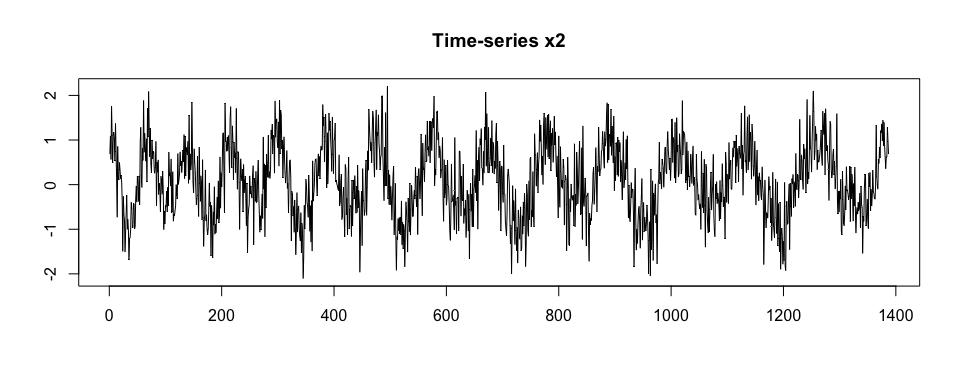
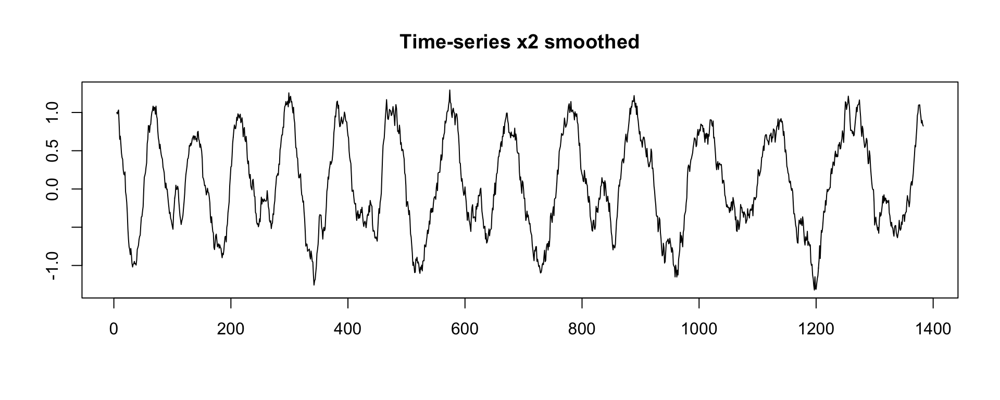

<!-- badges: start -->

[](https://CRAN.R-project.org/package=adept)
[](https://cran.r-project.org/package=adept)
[](https://cran.r-project.org/package=adept)
[](https://github.com/martakarass/adept/actions/workflows/R-CMD-check.yaml)
[](https://codecov.io/gh/martakarass/adept?branch=master)
<!-- badges: end -->

### Overview

The `adept` package implements ADaptive Empirical Pattern Transformation
(ADEPT) method[^1] for pattern segmentation from a time-series. ADEPT is
optimized to perform fast, accurate walking strides segmentation from
high-density data collected with a wearable accelerometer during
walking. The method was validated using data collected with sensors worn
at left wrist, left hip and both ankles.

### Installation

Install `adept` package from GitHub.

``` r
# install.packages("devtools")
devtools::install_github("martakarass/adept")
```

### Example 1

We simulate a time-series `x`. We assume that `x` is collected at a
frequency of 100 Hz, there is one shape of a pattern within `x`, each
pattern lasts 1 second, and there is no noise in collected data.

``` r
true.pattern <- cos(seq(0, 2 * pi, length.out = 100))
x <- c(true.pattern[1], replicate(10, true.pattern[-1]))

par(mfrow = c(1,2), cex = 1)
plot(true.pattern, type = "l", xlab = "", ylab = "", main = "Pattern")
plot(x, type = "l", xlab = "", ylab = "", main = "Time-series x")
```



We segment pattern from data. We assume that a perfect template is
available. We use a grid of potential pattern durations of {0.9, 0.95,
1.03, 1.1} seconds; the grid is imperfect in a sense it does not contain
the duration of the true pattern used in `x` simulation.

``` r
library(adept)

segmentPattern(
  x = x,
  x.fs = 100,
  template = true.pattern,
  pattern.dur.seq = c(0.9, 0.95, 1.03, 1.1),
  similarity.measure = "cor",
  compute.template.idx = TRUE)
#>    tau_i T_i     sim_i template_i
#> 1      4  95 0.9987941          1
#> 2     98 103 0.9992482          1
#> 3    202  95 0.9987941          1
#> 4    296 103 0.9992482          1
#> 5    400  95 0.9987941          1
#> 6    494 103 0.9992482          1
#> 7    598  95 0.9987941          1
#> 8    692 103 0.9992482          1
#> 9    796  95 0.9987941          1
#> 10   895  95 0.9987941          1
```

The segmentation result is a data frame, where each row describes one
identified pattern occurrence:

- `tau_i` - index of `x` where pattern starts,
- `T_i` - pattern duration, expressed in `x` vector length,
- `sim_i` - similarity between a template and `x`,
- `template_i` - index of a template best matched to a time-series `x`
  (here: one template was used, hence all `template_i`’s equal 1).

We then assume a grid of potential pattern durations which contains the
duration of the true pattern used in data simulation. A perfect match
(`sim_i = 1`) between a time-series `x` and a template is obtained.

``` r
segmentPattern(
  x = x,
  x.fs = 100,
  template = true.pattern,
  pattern.dur.seq = c(0.9, 0.95, 1, 1.03, 1.1),
  similarity.measure = "cor",
  compute.template.idx = TRUE)
#>    tau_i T_i sim_i template_i
#> 1      1 100     1          1
#> 2    100 100     1          1
#> 3    199 100     1          1
#> 4    298 100     1          1
#> 5    397 100     1          1
#> 6    496 100     1          1
#> 7    595 100     1          1
#> 8    694 100     1          1
#> 9    793 100     1          1
#> 10   892 100     1          1
```

### Example 2

We simulate a time-series `x`. We assume that `x` is collected at a
frequency of 100 Hz, there are two shapes of a pattern within `x`,
patterns have various duration, and there is no noise in collected data.

Then, we generate `x2` as a noisy version of `x`.

``` r
true.pattern.1 <- cos(seq(0, 2 * pi, length.out = 200))
true.pattern.2 <- true.pattern.1
true.pattern.2[70:130] <- 2 * true.pattern.2[min(70:130)] + abs(true.pattern.2[70:130])
x <- numeric()
for (vl in seq(70, 130, by = 10)){
  true.pattern.1.s <- approx(
    seq(0, 1, length.out = 200), 
    true.pattern.1, xout = seq(0, 1, length.out = vl))$y
  true.pattern.2.s <- approx(
    seq(0, 1, length.out = 200), 
    true.pattern.2, xout = seq(0, 1, length.out = vl))$y
  x <- c(x, true.pattern.1.s[-1], true.pattern.2.s[-1])
  if (vl == 70) x <- c(true.pattern.1.s[1], x)
}
set.seed(1)
x2 <- x + rnorm(length(x), sd = 0.5)

par(mfrow = c(1,2), cex = 1)
plot(true.pattern.1, type = "l", xlab = "", ylab = "", main = "Pattern 1")
plot(true.pattern.2, type = "l", xlab = "", ylab = "", main = "Pattern 2")
```



``` r
par(mfrow = c(1,1), cex = 1)
plot(x, type = "l", xlab = "", ylab = "", main = "Time-series x")
```



``` r
plot(x2, type = "l", xlab = "", ylab = "", main = "Time-series x2")
```



We segment `x`. We assume a perfect grid of potential pattern duration,
{0.7, 0.8, 0.9, 1.0, 1.1, 1.2, 1.3} seconds.

``` r
segmentPattern(
  x = x,
  x.fs = 100,
  template = list(true.pattern.1, true.pattern.2),
  pattern.dur.seq = seq(0.7, 1.3, by = 0.1),
  similarity.measure = "cor",
  compute.template.idx = TRUE)
#>    tau_i T_i sim_i template_i
#> 1      1  70     1          1
#> 2     70  70     1          2
#> 3    139  80     1          1
#> 4    218  80     1          2
#> 5    297  90     1          1
#> 6    386  90     1          2
#> 7    475 100     1          1
#> 8    574 100     1          2
#> 9    673 110     1          1
#> 10   782 110     1          2
#> 11   891 120     1          1
#> 12  1010 120     1          2
#> 13  1129 130     1          1
#> 14  1258 130     1          2
```

We segment `x2`.

``` r
segmentPattern(
  x = x2,
  x.fs = 100,
  template = list(true.pattern.1, true.pattern.2),
  pattern.dur.seq = seq(0.7, 1.3, by = 0.1),
  similarity.measure = "cor",
  compute.template.idx = TRUE)
#>    tau_i T_i     sim_i template_i
#> 1      1  70 0.8585451          1
#> 2    138  80 0.7624002          1
#> 3    218  80 0.7025577          2
#> 4    297  90 0.8500864          1
#> 5    390  80 0.6931671          2
#> 6    469 110 0.8286013          1
#> 7    579  90 0.6373846          2
#> 8    668 120 0.8027177          1
#> 9    787 100 0.6666713          2
#> 10   888 130 0.7894766          1
#> 11  1017 110 0.6599280          1
#> 12  1129 130 0.7938183          1
#> 13  1267 120 0.7655408          2
```

We now use `x.adept.ma.W` argument to smooth `x2` before similarity
matrix computation in the segmentation procedure (see `?segmentPattern`
for details). We also assume a more dense grid of potential pattern
duration. We observe that `sim_i` values obtained are higher than in the
previous segmentation case.

``` r
par(mfrow = c(1,1), cex = 1)
plot(windowSmooth(x = x2, x.fs = 100, W = 0.1), 
     type = "l", xlab = "", ylab = "", main = "Time-series x2 smoothed")
```



``` r
segmentPattern(
  x = x2,
  x.fs = 100,
  template = list(true.pattern.1, true.pattern.2),
  pattern.dur.seq = 70:130 * 0.01,
  similarity.measure = "cor",
  x.adept.ma.W = 0.1,
  compute.template.idx = TRUE)
#> Smoothing x signal for similarity matrix computation with moving average window of length: 10
#>    tau_i T_i     sim_i template_i
#> 1      1  70 0.9865778          1
#> 2     70  70 0.9533684          2
#> 3    139  79 0.9683054          1
#> 4    217  80 0.9748040          2
#> 5    296  94 0.9802473          1
#> 6    391  82 0.9462213          2
#> 7    472 106 0.9855837          1
#> 8    578  93 0.9608881          2
#> 9    670 115 0.9887225          1
#> 10   784 107 0.9562694          2
#> 11   896 113 0.9734575          1
#> 12  1008 127 0.9703118          1
#> 13  1134 116 0.9606235          1
#> 14  1266 122 0.9593345          2
```

### Vignettes

Vignettes are available to better demonstrate package methods usage.

1.  Vignette [Introduction to adept
    package](https://martakarass.github.io/adept/articles/adept-intro.html)
    introduces ADEPT algorithm and demonstrates the usage of
    `segmentPattern` function which implements ADEPT approach. Here, we
    focus on examples with simulated data.

2.  Vignette [Walking strides segmentation with
    adept](https://martakarass.github.io/adept/articles/adept-strides-segmentation.html)
    provides an example of segmentation of walking strides (two
    consecutive steps) in sub-second accelerometry data with `adept`
    package. The exemplary dataset is a part of the `adeptdata` package.
    We demonstrate that ADEPT can be used to perform automatic and
    precise walking stride segmentation from data collected during a
    combination of running, walking and resting exercises. We introduce
    how to segment data:

    1.  with the use of stride templates that were pre-computed based on
        data from an external study (attached to `adeptdata` package),
    2.  by deriving new stride templates in a semi-manual manner.

### References

[^1]: Karas, M., Straczkiewicz, M., Fadel, W., Harezlak, J.,
    Crainiceanu, C., Urbanek, J.K. *Adaptive empirical pattern
    transformation (ADEPT) with application to walking stride
    segmentation*, Submitted to *Biostatistics*, 2018.
