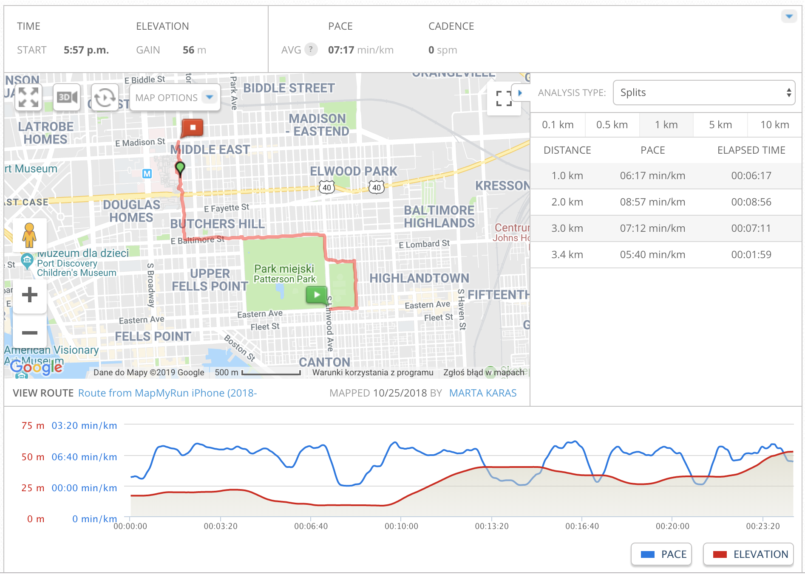

```{r setup, include = FALSE}
knitr::opts_chunk$set(
  collapse = TRUE,
  comment = "#>",
  warning = FALSE,
  message = FALSE,
  global.par = TRUE
)
```

This vignette provides an example of walking stride segmentation from subsecond accelerometry data with `adept` package. We demonstrate that ADEPT method ([3]) can be used to perform automatic and precise walking stride segmentation from data collected during a combination of running, walking and resting exercise. We demonstrate how to segment data (a) with the use of stride templates that were pre-computed based on data from an external study, (b) by deriving new stride templates in a semi-manual manner. 

See *"Introduction to `adept` package"* vignette ([1]) for an introduction  to the ADEPT method and usage examples of the `segmentPattern` function which implements the ADEPT method.

# Raw accelerometry data sample

The `adept` package comes with a sample of raw accelerometry data collected during 25 minutes of an outdoor run. Data were collected at frequency 100 Hz with two ActiGraph GT9X Link sensors located at left hip and left ankle. 

### Running trial

Based on a *mapmyrun* mobile tracking application, the distance covered while an application was turned on is approximately 3.35 km. The ground elevation difference between start and end point of the data collection is approximately 36 m (17 m at the start point, 53 m at the finish point). The data sample attached is a subset of accelerometry data collected over a few days time; the sample attached should match the time while an application was turned on up to ~1 minute accuracy. 

```{r echo=FALSE, out.width='90%'}

```
</br><small><small><small>
Screenshot taken from a personal profile of *mapmyrun* tracking application, accessed via https://www.mapmyrun.com. 
</small></small></small>


### Sensor and accelerometry data

The data were collected with two ActiGraph GT9X Link sensors at frequency 100 Hz. [ActiGraph GT9X Link](https://www.actigraphcorp.com/actigraph-link/) is an activity monitor which includes 3-axis accelerometer measuring body acceleration along three orthogonal axes. At frequency 100 Hz, 100 observations are collected each second, where each observation consists of 3 data points (one data point from each of three orthogonal axes), yielding a total of 300 data points per second.  

### Sensor location

One of the sensors was attached to the shoe with a clip on the outside side of a left foot, just below the left ankle. The other sensor was attached to the elastic belt located at hip, on the left side of a hip. Both devices stayed in a fairly stable way during the run. 

```{r echo=FALSE, out.width='40%'}
knitr::include_graphics('img/sensor_la.jpg');
```
</br><small><small><small>
Wearable accelerometer devices location during the experiment. The devices were still covered with a protective plastic foil. 
</small></small></small>


### Data set `acc_running`

The sample accelerometry data is attached to the package as `acc_running` data frame. To access the data, load  `adept` package. 

```{r}
# install.packages("devtools")
# devtools::install_github("martakarass/adept")
library(adept)
head(acc_running)
```

`acc_running` consists of 300,000 observations of 5 variables:

* `x` - acceleration measurement time series collected from a $x$-axis of the sensor accelerometer,
* `y` - acceleration measurement time series collected from a $y$-axis of the sensor accelerometer,
* `x` - acceleration measurement time series collected from a $z$-axis of the sensor accelerometer,
* `vm` - vector magnitude of $(x,y,z)$ vector of measurements, computed as $vm = \sqrt{x^2+y^2+z^2}$,
* `date_time` - date and time of acceleration measurement collection stored as `POSIXct`,
* `sensor_location` - sensor location label, one of: `"left_hip"`, `"left_ankle"`.


##### Notes on `date_time` column values

* The knitr HTML output truncates the subsecond level accuracy of `POSIXct` values stored in `date_time` column, hence in first rows of the table we see `2018-10-25 17:57:30` only; when `head(acc_running)` is executed in the `R` console, the result would be likely `2018-10-25 17:57:30.00`, `2018-10-25 17:57:30.01` etc. 

* When `head(acc_running)` is executed in the console, seemingly, there is "an error" in `date_time` column; indeed, we would expect its second value to be `17:57:30.01`, not: `17:57:30.00`. The `date_time` column was generated via `seq(from = as.POSIXct("2018-10-25 17:57:30.00"), by = 0.01, length.out = nrow(dat_sub))`; I identify the problem to be the floating point arithmetic problem, as discussed in [this SO question](https://stackoverflow.com/questions/11571105/odd-behavor-with-posixct-posixlt-and-subsecond-accuracy). Such errors are "made up for" over the column values, and the whole `date_time` has expected range of time. 

Time collection spans 25 minutes. It agrees with a number of observations per sensor we have (`150000`), given the data was collected at frequency 100 observations per second. 
```{r}
range(acc_running$date_time)
table(acc_running$sensor_location)
150000 / (100 * 60)  
```

# Accelerometry data visualization

### Raw accelerometry data 

One way to visualize raw accelerometry data is to plot it as a three-dimensional time-series. Here, we plot data from three different time frames, each of 4 seconds length, simultaneously for data collected at left ankle and right ankle. 

```{r plot_xyz, fig.width=7.5, fig.height=4.7}
library(dplyr)
library(ggplot2)
library(reshape2)
library(lubridate)
library(gridExtra)

## Define time frame start values for data subset
t1 <- as.POSIXct("2018-10-25 18:00:00") 
t2 <- as.POSIXct("2018-10-25 18:10:00") 
t3 <- as.POSIXct("2018-10-25 18:22:00") 

## Subset data 
acc_running_sub <- 
  adept::acc_running %>%
  filter((date_time >= t1 & date_time < t1 + 4) | 
           (date_time >= t2 & date_time < t2 + 4) | 
           (date_time >= t3 & date_time < t3 + 4)) 

## Plot (x,y,z) values 
df = acc_running_sub %>%
  select(-vm) %>%
  melt(id.vars = c("date_time", "sensor_location")) %>%
  mutate(dt_floor = paste0("time frame start: ", 
                           floor_date(date_time, unit = "minutes")))
if (nrow(df) > 0) {
  p = df %>%
    ggplot(aes(x = date_time, y = value, color = variable)) + 
    geom_line(size = 0.5) + 
    facet_grid(sensor_location ~ dt_floor, scales = "free_x") + 
    theme_bw(base_size = 10) + 
    labs(x = "Time [s]", y = "Acceleration [g]", color = "Axis: ",
         title = "(x,y,z) three-dimensional time-series") + 
    theme(legend.position = "top")
  print(p)
} else {
  stop("ac_running_sub has no rows!")
}
```

##### Note on sensors desynchronization 

The two sensors used in experiment were set up to initialize their measurement collection at the same time. However, as discussed in [2], even when simultaneous initialization of the devices is used, measurements might still get desynchronized between devices after hours and/or days of data collection. For that possible reason, one should not expect 0.01 s-level alignment between the data collected form left ankle and left hip on the plots above.    


### Vector magnitude 

Using vector magnitude $(vm)$ is a way to summarize a three-dimensional time-series $(x,y,z)$ as a one-dimensional time-series. Vector magnitude is computed as $vm = \sqrt{x^2 + y^2 + z^2}$ at each time point of data collection. 

```{r plot_vm, fig.width=7.5, fig.height=4.3}
## Plot vector magnitude values 
acc_running_sub %>%
  mutate(dt_floor = paste0("time frame start: ", 
                           floor_date(date_time, unit = "minutes"))) %>%
  ggplot(aes(x = date_time, y = vm)) + 
  geom_line(size = 0.5) + 
  facet_grid(sensor_location ~ dt_floor, scales = "free_x") + 
  theme_bw(base_size = 10) + 
  labs(x = "Time [s]", y = "Vector magnitue [g]", color = "Axis: ",
       title = "Vector magnitude (vm) one-dimensional time-series") 
```

##### Observations 

From the $(x,y,z)$ and $(vm)$ plots we can tell the presence of an asymmetric repetitive pattern associated with each walking stride (stride := two subsequent steps). Also, there are differences in data magnitude and stride duration between the three vertical plot panels: 

* The left vertical plot panel (`time frame start: 2018-10-25 18:00:00`) corresponds to relatively fast running on a surface with no elevation changes; $(vm)$ time-series exhibits high magnitude. Also, there are more stride pattern occurrences captured within this time frame panel than on the two other panels, which suggests a higher ratio of strides per second performed by a runner in that time window. 

* The middle vertical plot panel (`time frame start: 2018-10-25 18:10:00`) corresponds to relatively slow running uphill; $(vm)$ exhibits relatively low magnitude of a signal and slightly different shape of stride pattern than in the left panel. 

* The right vertical plot panel (`time frame start: 2018-10-25 18:22:00`) corresponds to moderate-pace run or, possibly, walking.
 
 
### Vector magnitude count  

Clearly, it might be challenging to make a plot of *all* data points collected at frequency 100 Hz from 25 minutes-long exercise. A way to summarize accelerometry data of such high density is to use a vector magnitude count (vmc; also known as the mean amplitude deviation). For $\overline{vm}(t,H)$ - average of $(vm)$ time-series over time window of length $H$ starting at time $t$, we define 
$$\mathrm { vmc } ( t, H ) = \frac { 1 } { H } \sum _ { h = 0 } ^ { H - 1 } | vm ( t + h ) - \overline{vm}(t,H) |.$$

```{r plot_vmc, fig.width=7.5, fig.height=4.3}
## Function to compute vmc from vm window vector
vmc <- function(vm.win){
  mean(abs(vm.win - mean(vm.win)))
}

vm <- acc_running$vm
## vector length of 3 seconds of vm data window
window.vl <- 100 * 3
## Sequence of indexes by which we cut signal into windows
rn.seq <- seq(1, to = length(vm), by = window.vl)
## Compute vmc 
vmc.vec <- sapply(rn.seq, function(rn.i){
  vm.win.idx <- rn.i : (rn.i + window.vl - 1)
  vm.win <- vm[vm.win.idx]
  vmc(vm.win)
})

## Plot vmc 
data.frame(vmc = vmc.vec,
           date_time = acc_running$date_time[rn.seq],
           sensor_location = acc_running$sensor_location[rn.seq]) %>%
  filter(date_time < max(acc_running$date_time) - 5, 
         date_time > min(acc_running$date_time) + 5) %>%
  ggplot(aes(x = date_time, y = vmc)) +
  facet_grid(sensor_location ~ .) + 
  geom_line(size = 0.3) +
  theme_bw(base_size = 10) + 
  labs(x = "Exercise time [min]", y = "Vector magnitue count",
       title = "Vector magnitude count (vmc) computed over 3 second-length windows of (vm)")
## Time percentage when vmc computed from left ankle is below 0.5
(vmc.low.frac <- mean(vmc.vec[acc_running$sensor_location[rn.seq] == "left_ankle"] < 0.5))
```

##### Observations 

* Roughly speaking, values of $(vmc)$ which are close to $0$ correspond to time where barely any movement was recorded with a sensor; in this experiment, they may correspond to a runner waiting on the crossroad for a green light to cross (or being tired and making breaks). 

* On the contrary, high values of  $(vmc)$ correspond to high volumes of physical activity recorded; in this experiment, at approx. 18:21 (6:21 PM) a short (~1 minute) period of a fast downhill run started, corresponding to particularly high values of $(vmc)$ recorded with both left ankle and left hip sensors.  

* We see that approx. 20\% of the time $(vmc)$ computed from left ankle data is below 0.5 value; that part of data likely corresponds to standing and waiting, not: running/walking. 

# Walking strides segmentation

To perform strides segmentation from $(vm)$ time-series, we need a stride pattern template that is specific to a sensor location that data were collected at. We are going to demonstrate two approaches: 

1. **Approach 1**: Use stride pattern templates attached to the `adept` package as `stride_template` object. These walking strides were derived from a set of manually pre-segmented strides from data collected in a different experiment, with different participants (see `?stride_template` for details). 

2. **Approach 2**: Derive stride pattern templates manually from `acc_running` data set.

### Smoothing parameter selection

The `segmentPattern` function algorithm has two phases in which a smoothed version of $(vm)$ time-series may be used: 

1. In computation of similarity matrix between pattern template and (possibly smoothed) $(vm)$ signal. Here, `x.adept.ma.W` argument of `segmentPattern` function defines a length of a window used in moving average smoothing; it is expressed in seconds. 

    For this phase, we recommend low/moderate smoothing (`x.adept.ma.W = 0.05`, `x.adept.ma.W = 0.15`) so as tiny $(vm)$ bumps are smoothed, but the pattern shape features are not lost. 

2. In "maxima" tuning procedure where local maxima of (possibly smoothed) $(vm)$ signal are identified as final beginnings and endings of a stride pattern occurrence. Here, `finetune.maxima.ma.W` argument of `segmentPattern` function defines a length of a window used in moving average smoothing; it is expressed in seconds. 

    For this phase, in case of a very clear signal and distinct signal local maxima, no smoothing may be used (`finetune.maxima.ma.W = NULL`); in case of low-signal and noisy data (i.e., often the case of data collected with a sensor located at wrist), high levels of smoothing (`finetune.maxima.ma.W = 0.3` or similar) may be used.
    
Function `windowSmooth {adept}` computes moving window average of a time-series `x` and may be used to experiment with different values of  smoothing window length (`W`; expressed in seconds). Results of exemplary choice of smoothing parameter are presented below.  

```{r plot_vm_smoothed2, fig.width=7, fig.height=4}
## Use moving window average with a length of a window equal 0.05 s 
acc_running$vm_smoothed1 <- windowSmooth(x = acc_running$vm, x.fs = 100, W = 0.05)

acc_running %>%
  filter((date_time >= t1 & date_time < t1 + 4) | 
           (date_time >= t2 & date_time < t2 + 4) | 
           (date_time >= t3 & date_time < t3 + 4)) %>%
  mutate(dt_floor = paste0("time frame start: ", 
                           floor_date(date_time, unit = "minutes"))) %>%
  ggplot(aes(x = date_time, y = vm_smoothed1)) + 
  geom_line(size = 0.5) + 
  facet_grid(sensor_location ~ dt_floor, scales = "free_x") + 
  theme_bw(base_size = 10) + 
  labs(x = "Time [s]", y = "Vector magnitue [g]", color = "Axis: ",
       title = "Vector magnitude (vm) smoothed, length of smoothing window = 0.05 s") 
```


### Segmentation with *Approach 1*: use existing stride pattern templates

##### Left ankle

We first construct a `template` object; it is a list of left ankle-specific stride templates. Here, we use two precomputed templates (see `?stride_template` for details). 

```{r segm_la, fig.width=6, fig.height=3}
template <- list(stride_template$left_ankle[[2]][1, ],
                 stride_template$left_ankle[[2]][2, ])
par(mfrow = c(1,2), cex = 0.7)
plot(template[[1]], type = "l", xlab = "", ylab = "", main = "Left ankle: template 1")
plot(template[[2]], type = "l", xlab = "", ylab = "", main = "Left ankle: template 2")
```

We perform strides segmentation from $(vm)$ accelerometry signal. See `?segmentPattern` for details explanation of parameters. 

```{r segm_la2, eval = FALSE}
x.la <- acc_running$vm[acc_running$sensor_location == "left_ankle"]
out1.la <- segmentPattern(x = x.la,
                          x.fs = 100,
                          template = template,
                          pattern.dur.seq = seq(0.5, 1.8, length.out = 50),
                          similarity.measure = "cor",
                          x.adept.ma.W = 0.15,
                          finetune = "maxima",
                          finetune.maxima.ma.W = 0.05,
                          finetune.maxima.nbh.W = 0.2,
                          compute.template.idx = TRUE,
                          run.parallel = TRUE)
```

```{r, eval = FALSE, include=FALSE}
path.tmp <- "static/results/out1_la.csv"
write.csv(out1.la, path.tmp, row.names = FALSE)
```

```{r, include=FALSE}
path.tmp <- "static/results/out1_la.csv"
x.la <- acc_running$vm[acc_running$sensor_location == "left_ankle"]
out1.la <- read.csv(path.tmp)
```

```{r}
head(out1.la)
```

Each row of the returned `data.frame` describes one identified pattern occurrence:

* `tau_i` - index of a vector (here: $(vm)$ time-series) where an identified pattern occurrence starts,
* `T_i` - duration of identified pattern occurrence, expressed in a vector length,
* `sim_i` - value of similarity statistic between an identified pattern occurrence and corresponding window of a time-series used in similarity matrix computation (see `?segmentPattern` for details),
* `template_i` - if `compute.template.idx` equals `TRUE`: index of pattern template that yielded highest similarity for an identified pattern occurrence; otherwise: `NA`.

We now run segmentation on data collected at left hip. We then compare the results.

##### Left hip

Construct `template` object; it is a list of left hip-specific stride templates.
```{r segm_lh, fig.width=6, fig.height=3}
template <- list(stride_template$left_hip[[1]][1, ],
                 stride_template$left_hip[[2]][2, ])
par(mfrow = c(1,2), cex = 0.7)
plot(template[[1]], type = "l", xlab = "", ylab = "", main = "Left hip: template 1")
plot(template[[2]], type = "l", xlab = "", ylab = "", main = "Left hip: template 2")
```

```{r segm_lh2, eval = FALSE}
template <- list(stride_template$left_hip[[1]][1, ],
                 stride_template$left_hip[[2]][2, ])
x.lh <- acc_running$vm[acc_running$sensor_location == "left_hip"]
out1.lh <- segmentPattern(x = x.lh,
                          x.fs = 100,
                          template = template,
                          pattern.dur.seq = seq(0.5, 1.8, length.out = 50),
                          similarity.measure = "cor",
                          x.adept.ma.W = 0.05,
                          finetune = "maxima",
                          finetune.maxima.ma.W = 0.15,
                          finetune.maxima.nbh.W = 0.2,
                          compute.template.idx = TRUE,
                          run.parallel = TRUE)
```

```{r, eval = FALSE, include=FALSE}
path.tmp <- "static/results/out1_lh.csv"
write.csv(out1.lh, path.tmp, row.names = FALSE)
```

```{r, include=FALSE}
x.lh <- acc_running$vm[acc_running$sensor_location == "left_hip"]
path.tmp <- "static/results/out1_lh.csv"
out1.lh <- read.csv(path.tmp)
```

```{r}
head(out1.lh)
```

#### Results: estimated stride duration time

We now plot estimated stride duration in seconds (`T_i`/100) against estimated  stride start in minutes (`tau_i`/(100*60)). Note: 

* From the computed $vmc$, we inferred that ~`r vmc.low.frac * 100`\% of the data time likely corresponds to standing and waiting (not: walking/running) time. Therefore, for the purposes of visualization, we discard ~`r vmc.low.frac * 100`\% of the strides segmented with the lowest similarity (`sim_i`) between stride pattern and $(vm)$ signal obtained. 

```{r, fig.width=7, fig.height=4}
## Time percentage when vmc computed from left ankle is below 0.5
vmc.low.frac

plt.df.la <- 
  out1.la %>%
  filter(sim_i > quantile(out1.la$sim_i, probs = vmc.low.frac)) %>%
  mutate(location = "left_ankle")
plt.df.lh <- 
  out1.lh %>%
  filter(sim_i > quantile(out1.lh$sim_i, probs = vmc.low.frac)) %>%
  mutate(location = "left_hip")

rbind(plt.df.la, plt.df.lh) %>%
  ggplot(aes(x = tau_i / (100 * 60) , y = T_i / 100)) + 
  geom_point(alpha = 0.2) + 
  facet_grid(location ~ .) + 
  theme_bw(base_size = 10) + 
  labs(x = "Exercise time [min]", y = "Estimated stride duration time [s]") + 
  theme(legend.position = "none")
```


#### Results: subject-specific stride pattern (left ankle)

We now use the estimated stride occurrence start index (`tau_i`) and estimated stride duration (`T_i`) to retrieve $(vm)$ time-series segments corresponding to stride occurrences. We further align them in phase and scale to better observe stride patterns. 

```{r, eval = FALSE}
## For data frame #1 (raw vm segments)
stride.acc.vec.la <- numeric()
stride.tau_i.vec.la <- numeric()
stride.idx.vec.la <- numeric()
## For data frame #2 (scaled vm segments)
stride_S.acc.vec.la <- numeric()
stride_S.tau_i.vec.la <- numeric()
stride_S.phase.vec.la <- numeric()

for (i in 1:nrow(plt.df.la)){
  out.i <- plt.df.la[i, ]
  x.la.i <- x.la[out.i$tau_i : (out.i$tau_i + out.i$T_i - 1)]
  x.la.i.len <- length(x.la.i)
  if (var(x.la.i) < 1e-3) next
  ## For data frame #1 
  stride.acc.vec.la   <- c(stride.acc.vec.la, x.la.i)
  stride.tau_i.vec.la <- c(stride.tau_i.vec.la, rep(out.i$tau_i, x.la.i.len))
  stride.idx.vec.la <- c(stride.idx.vec.la, 1:x.la.i.len)
  ## For data frame #2
  x.la.i_S <- approx(x = seq(0, 1, length.out = length(x.la.i)),
                     y = x.la.i,
                     xout = seq(0, 1, length.out = 200))$y
  x.la.i_S <- as.numeric(scale(x.la.i_S))
  stride_S.acc.vec.la <- c(stride_S.acc.vec.la, x.la.i_S)
  stride_S.tau_i.vec.la <- c(stride_S.tau_i.vec.la, rep(out.i$tau_i, 200))
  stride_S.phase.vec.la <- c(stride_S.phase.vec.la, seq(0, 1, length.out = 200))
}

## data frame #1 
stride.df.la <- data.frame(acc = stride.acc.vec.la, 
                           tau_i = stride.tau_i.vec.la,
                           idx = stride.idx.vec.la)
## data frame #2
stride_S.df.la <- data.frame(acc = stride_S.acc.vec.la, 
                             tau_i = stride_S.tau_i.vec.la,
                             phase = stride_S.phase.vec.la)
```

```{r, eval = FALSE, include=FALSE}
## For data frame #1 
path.tmp <- "static/results/stride_df_la.csv"
write.csv(stride.df.la, path.tmp, row.names = FALSE)
## For data frame #2
path.tmp <- "static/results/stride_S_df_la.csv"
write.csv(stride_S.df.la, path.tmp, row.names = FALSE)
```

```{r, include=FALSE}
## For data frame #1 
path.tmp <- "static/results/stride_df_la.csv"
stride.df.la <- read.csv(path.tmp)
## For data frame #2
path.tmp <- "static/results/stride_S_df_la.csv"
stride_S.df.la <- read.csv(path.tmp)
```

```{r, fig.width=7, fig.height=3}
## Plot segmented walking strides
plt1 <- 
  stride.df.la %>%
  ggplot(aes(x = idx/100, y = acc, group = tau_i)) + 
  geom_line(alpha = 0.1) + 
  theme_bw(base_size = 8) + 
  labs(x = "Stride pattern duration [s]", y = "Vector magnitude [g]",
       title = "Segmented walking strides")
plt2 <- 
  stride_S.df.la %>%
  ggplot(aes(x = phase, y = acc, group = tau_i)) + 
  geom_line(alpha = 0.1) + 
  theme_bw(base_size = 8) + 
  labs(x = "Stride pattern phase", y = "Vector magnitude (scaled) [g]",
       title = "Segmented walking strides, aligned and scaled") 
grid.arrange(plt1, plt2, nrow = 1)
```

* From the plot of aligned and scaled strides (right hand side above), it seems there are at least two distinct stride patterns pronounced in data - one with a "spike with a dip" in a middle of a stride pattern phase, and another, less frequent (fewer lines on the plot), with a spike at approx. 2/3 of a stride pattern phase. 

##### Correlation clustering of segmented walking strides

We can further use correlation clustering to group segmented walking strides. 

```{r, eval = FALSE, }
## Compute strides distance martrix
stride_S.dfdc.la <- dcast(stride_S.df.la, phase ~ tau_i, value.var = "acc")[, -1]
data.mat.tau_i <- as.numeric(colnames(stride_S.dfdc.la))
data.mat <-  as.matrix(stride_S.dfdc.la)
D.mat  <- dist(cor(data.mat))
## Get cluster medoids
cluster.k <- 2
medoids.idx <- round(seq(1, ncol(stride_S.dfdc.la), length.out = cluster.k + 2))
medoids.idx <- medoids.idx[-c(1, medoids.idx + 2)]
## Cluster strides
pam.out <- cluster::pam(D.mat, cluster.k, diss = TRUE, medoids = medoids.idx)
table(pam.out$clustering)
## Put clustering results into data frame 
data.df <- as.data.frame(t(data.mat))
colnames(data.df) <- seq(0, to = 1, length.out = 200)
data.df$tau_i <- data.mat.tau_i
data.df$cluster <- pam.out$clustering
data.dfm <- melt(data.df, id.vars = c("tau_i", "cluster"))
data.dfm$variable <- as.numeric(as.character(data.dfm$variable))
data.dfm$cluster <- paste0("cluster ", data.dfm$cluster)
```

```{r, eval = FALSE, include=FALSE}
path.tmp <- "static/results/data_dfm.csv"
write.csv(data.dfm, path.tmp, row.names = FALSE)
```

```{r, include=FALSE}
path.tmp <- "static/results/data_dfm.csv"
data.dfm <- read.csv(path.tmp)
```


```{r, fig.width=4, fig.height=5.1}
data.dfm.agg <- 
  data.dfm %>%
  group_by(variable, cluster) %>% 
  summarise(value = mean(value))
ggplot(data.dfm, aes(x = variable, y = value, group = tau_i)) + 
  geom_line(alpha = 0.2) + 
  geom_line(data = data.dfm.agg,  aes(x = variable, y = value, group = 1),
            color = "red", size = 1, inherit.aes = FALSE) +  
  facet_grid(cluster ~ .) + 
  theme_bw(base_size = 8) + 
  labs(x = "Stride pattern phase", y = "Vector magnitude (scaled) [g]",
       title = "Segmented walking strides, aligned, scaled, clustered\nRed line: point-wise mean") 

```

We can further plot the estimated stride duration time over the course of the running exercise, marking the stride cluster assignment with colour. 

```{r, fig.width=7, fig.height=2.8}
data.dfm %>%
  select(tau_i, cluster)  %>%
  distinct() %>%
  left_join(plt.df.la, by = "tau_i") %>%
  ggplot(aes(x = tau_i / (100 * 60) , y = T_i / 100, color = cluster)) + 
  geom_point(alpha = 0.4) + 
  theme_bw(base_size = 10) + 
  labs(x = "Exercise time [min]", y = "Estimated stride duration time [s]",
       color = "Stride assignment: ") + 
  theme(legend.position = "top")
```

##### Observations

* From the plot above we can note that strides of longer estimated stride duration time (blue color) cluster together; they most likely correspond to walking (i.e. crossing the crossroad).  


### Segmentation with *Approach 2*: derive stride pattern templates manually

We now demonstrate a way of deriving stride patterns from data in a semi-manual way. The proposed procedure is done separately for data collected at two different locations, and goes as follows: 

1. Select short fragments of $(vm)$ time-series that are likely to represent data coming from different pace of running/walking. Here, we select three such $(vm)$ fragments, each of 6 seconds length, similarly as we did above for $(x,y,z)$ and $(vm)$ visualization. 
    
2. Within each of three $(vm)$ fragments, use a function to automatically identify *all* local maxima.

3. Within each of three $(vm)$ fragments, identify a *subset* of local maxima that corresponds to $(vm)$ peaks of interest via visual inspection ("manual" part). 

4. For each of three $(vm)$ fragments, cut the $(vm)$ fragment into parts at the points of identified local maxima subset. Interpolate parts to common a length and compute their point-wise average. The resulted point-wise average is a newly created pattern template. 

That way, for each sensor location, we arrive at three distinct stride pattern templates that we further use in segmentation. 

```{r}
## Function to compute local maxima
## source: https://stackoverflow.com/questions/6836409/finding-local-maxima-and-minima
localMaxima <- function(x) {
  y <- diff(c(-.Machine$integer.max, x)) > 0L
  rle(y)$lengths
  y <- cumsum(rle(y)$lengths)
  y <- y[seq.int(1L, length(y), 2L)]
  if (x[[1]] == x[[2]]) {
    y <- y[-1]
  }
  y
}

## Function which cut x vector at indices given by x.cut.idx,
## approximate cut parts into common length and average 
## parts point-wise into one vector
cut.and.avg <- function(x, x.cut.idx){
  x.cut.idx.l <- length(x.cut.idx)
  mat.out <- matrix(NA, nrow = x.cut.idx.l-1, ncol = 200)
  for (i in 1:(length(x.cut.idx)-1)){
    xp <- x[x.cut.idx[i]:x.cut.idx[i+1]]
    mat.out[i, ] <- approx(seq(0, 1, length.out = length(xp)), xp, seq(0, 1, length.out = 200))$y
  }
  out <- apply(mat.out, 2, mean)
}

## Make subset of data which has data parts of different speed of running
acc_running_sub2 <- 
  acc_running %>%
  filter((date_time >= t1 & date_time < t1 + 6) | 
           (date_time >= t2 & date_time < t2 + 6) | 
           (date_time >= t3 & date_time < t3 + 6))  %>%
  mutate(dt_floor = floor_date(date_time, unit = "minutes"))
## Vector of signatures for data parts of different speed of running
dt_floor.unique <- unique(acc_running_sub2$dt_floor)
```

##### Deriving stride patterns in a semi-manual way: left ankle

```{r, fig.width = 7, fig.height=2.3}
## Left ankle-specific subset of data  
sub.la <- acc_running_sub2[acc_running_sub2$sensor_location == "left_ankle", ]
par(mfrow = c(1,3), cex = 0.6)

## Left ankle: template 1
x1 <- sub.la[sub.la$dt_floor == dt_floor.unique[1], "vm_smoothed1"]
x1.locMax <- localMaxima(x1)
plot(1:length(x1), x1, type = "l", main = "(vm) local maxima", xlab = "Index", ylab = "")
abline(v = x1.locMax, col = "red")
plot(1:length(x1), x1, type = "l", main = "(vm) local maxima subset", xlab = "Index", ylab = "")
abline(v = x1.locMax[c(2, 8, 11, 14, 17, 22, 25, 29)], col = "red")
template.la.x1 <- cut.and.avg(x1, x1.locMax[c(2, 8, 11, 14, 17, 22, 25, 29)])
plot(1:length(template.la.x1), template.la.x1, type = "l", 
     col = "red", main = "left ankle: template 1", xlab = "Index", ylab = "")

## Left ankle: template 2
x2 <- sub.la[sub.la$dt_floor == dt_floor.unique[2], "vm_smoothed1"]
x2.locMax <- localMaxima(x2)
plot(1:length(x2), x2, type = "l", main = "(vm) local maxima", xlab = "Index", ylab = "")
abline(v = x2.locMax, col = "red")
plot(1:length(x2), x2, type = "l", main = "(vm) local maxima subset", xlab = "Index", ylab = "")
abline(v = x2.locMax[c(1, 10, 19, 26, 39)], col = "red")
template.la.x2 <- cut.and.avg(x2, x2.locMax[c(1, 10, 19, 26, 39)])
plot(1:length(template.la.x2), template.la.x2, type = "l", 
     col = "red", main = "left ankle: template 2", xlab = "Index", ylab = "")

## Left ankle: template 3
x3 <- sub.la[sub.la$dt_floor == dt_floor.unique[3], "vm_smoothed1"]
x3.locMax <- localMaxima(x3)
plot(1:length(x3), x3, type = "l", main = "(vm) local maxima", xlab = "Index", ylab = "")
abline(v = x3.locMax, col = "red")
plot(1:length(x3), x3, type = "l", main = "(vm) local maxima subset", xlab = "Index", ylab = "")
abline(v = x3.locMax[c(1, 8, 18, 26, 37, 44)], col = "red")
template.la.x3 <- cut.and.avg(x3, x3.locMax[c(1, 8, 18, 26, 37, 44)])
plot(1:length(template.la.x3), template.la.x3, type = "l", 
     col = "red", main = "left ankle: template 3", xlab = "Index", ylab = "")

## Template object
template.la <- list(template.la.x1, template.la.x2, template.la.x3)
```


##### Deriving stride patterns in a semi-manual way: left hip

```{r, fig.width = 7, fig.height=2.3}
## Left hip-specific subset of data  
sub.lh <- acc_running_sub2[acc_running_sub2$sensor_location == "left_hip", ]
par(mfrow = c(1,3), cex = 0.6)

## Left hip: template 1 
x1 <- sub.lh[sub.lh$dt_floor == dt_floor.unique[1], "vm_smoothed1"]
x1.locMax <- localMaxima(x1)
plot(1:length(x1), x1, type = "l", main = "(vm) local maxima", xlab = "Index", ylab = "")
abline(v = x1.locMax, col = "red")
plot(1:length(x1), x1, type = "l", main = "(vm) local maxima subset", xlab = "Index", ylab = "")
abline(v = x1.locMax[c(2, 7, 13, 18, 23, 29, 36, 41)], col = "red")
template.lh.x1 <- cut.and.avg(x1, x1.locMax[c(2, 7, 13, 18, 23, 29, 36, 41)])
plot(1:length(template.lh.x1), template.lh.x1, type = "l", 
     col = "red", main = "left ankle: template 1", xlab = "Index", ylab = "")

## Left hip: template 2
x2 <- sub.lh[sub.lh$dt_floor == dt_floor.unique[2], "vm_smoothed1"]
x2.locMax <- localMaxima(x2)
plot(1:length(x2), x2, type = "l", main = "(vm) local maxima", xlab = "Index", ylab = "")
abline(v = x2.locMax, col = "red")
plot(1:length(x2), x2, type = "l", main = "(vm) local maxima subset", xlab = "Index", ylab = "")
abline(v = x2.locMax[c(1, 7, 15, 23, 29)], col = "red")
template.lh.x2 <- cut.and.avg(x2, x2.locMax[c(1, 7, 15, 23, 29)])
plot(1:length(template.lh.x2), template.lh.x2, type = "l", 
     col = "red", main = "left ankle: template 2", xlab = "Index", ylab = "")

## Left hip: template 3
x3 <- sub.lh[sub.lh$dt_floor == dt_floor.unique[3], "vm_smoothed1"]
x3.locMax <- localMaxima(x3)
plot(1:length(x3), x3, type = "l", main = "(vm) local maxima", xlab = "Index", ylab = "")
abline(v = x3.locMax, col = "red")
plot(1:length(x3), x3, type = "l", main = "(vm) local maxima subset", xlab = "Index", ylab = "")
abline(v = x3.locMax[c(5, 13, 19, 24, 31)], col = "red")
template.lh.x3 <- cut.and.avg(x3, x3.locMax[c(5, 13, 19, 24, 31)])
plot(1:length(template.lh.x3), template.lh.x3, type = "l", 
     col = "red", main = "left ankle: template 3", xlab = "Index", ylab = "")

## Template object
template.lh <- list(template.lh.x1, template.lh.x2, template.lh.x3)
```


##### Segmentation

```{r segm_app2_la2, eval = FALSE}
out2.la <- segmentPattern(x = x.la,
                          x.fs = 100,
                          template = template.la,
                          pattern.dur.seq = seq(0.5, 1.8, length.out = 50),
                          similarity.measure = "cor",
                          x.adept.ma.W = 0.15,
                          finetune = "maxima",
                          finetune.maxima.ma.W = 0.05,
                          finetune.maxima.nbh.W = 0.2,
                          compute.template.idx = TRUE,
                          run.parallel = TRUE)

out2.lh <- segmentPattern(x = x.lh,
                          x.fs = 100,
                          template = template.lh,
                          pattern.dur.seq = seq(0.5, 1.8, length.out = 50),
                          similarity.measure = "cor",
                          x.adept.ma.W = 0.05,
                          finetune = "maxima",
                          finetune.maxima.ma.W = 0.15,
                          finetune.maxima.nbh.W = 0.2,
                          compute.template.idx = TRUE,
                          run.parallel = TRUE)
```

```{r, eval = FALSE, include=FALSE}
path.tmp <- "static/results/out2_la.csv"
write.csv(out2.la, path.tmp, row.names = FALSE)
path.tmp <- "static/results/out2_lh.csv"
write.csv(out2.lh, path.tmp, row.names = FALSE)
```

```{r, include=FALSE}
path.tmp <- "static/results/out2_la.csv"
out2.la <- read.csv(path.tmp)
path.tmp <- "static/results/out2_lh.csv"
out2.lh <- read.csv(path.tmp)
```


#### Results: estimated stride duration time

```{r, fig.width=7, fig.height=4}
plt.df.la <- 
  out2.la %>%
  filter(sim_i > quantile(out1.la$sim_i, probs = vmc.low.frac)) %>%
  mutate(location = "left_ankle")
plt.df.lh <- 
  out2.lh %>%
  filter(sim_i > quantile(out1.lh$sim_i, probs = vmc.low.frac)) %>%
  mutate(location = "left_hip")

rbind(plt.df.la, plt.df.lh) %>%
  ggplot(aes(x = tau_i / (100 * 60) , y = T_i / 100)) + 
  geom_point(alpha = 0.2) + 
  facet_grid(location ~ .) + 
  theme_bw(base_size = 10) + 
  labs(x = "Exercise time [min]", y = "Estimated stride duration time [s]") + 
  theme(legend.position = "none")
```

##### Observations

* From the plot above we see that the estimated stride duration times are fairly consistent between the two sensor locations, and also consistent with the estimates we obtained based on external, pre-computed stride pattern templates. 

* In the plot above, we do see discrepancies in a presence of certain points between upper and lower plot panels; recall that the segmentation results were filtered to keep only these estimates for which corresponding similarity between $(vm)$ and pattern template was higher than a 19.6th percentile threshold, which might have been different between left ankle and left hip stride segmentation results.    


# References

References: 

1: Karas, M. *"Introduction to `adept` package"* package vignette. 

2: Karas, M., Bai, J., Straczkiewicz, M., Harezlak, J., Glynn, N W., Harris, T., Zipunnikov, V., Crainiceanu, C., Urbanek, J.K. Accelerometry data in health research: challenges and opportunities. Review and examples, Statistics in Biosciences, 2018. ([link](https://rdcu.be/bgLtM))

3: Karas, M., Straczkiewicz, M., Fadel, W., Harezlak, J., Crainiceanu, C., Urbanek, J.K. Adaptive empirical pattern transformation (ADEPT) with application to walking stride segmentation, Submitted to Biostatistics, 2018.


